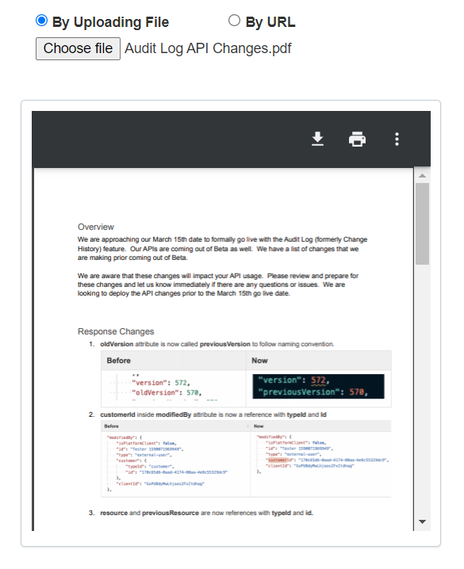

# react-file-preview

React component to render and preview images, pdf and text files via file object or web url

## Example



```jsx
import React, { Component } from "react";
import FilePreview from "react-file-preview";

class App extends Component {
  constructor() {
    super();
    this.state = {
      file: null,
    };
  }
  
  onError = (err) => console.log("Error:", err); // Write your own logic

  render() {
    return (
      <FilePreview
        type={"file"}
        file={this.state.file}
        onError={this.onError}
      />
    );
  }
}

export default App;
```

## Install

```cli
npm install react-file-preview
```

## Props

##### `type`

It can be either `file` or `url`.

---

##### `file`

The file object of input[type="file"] element which needs to be previewed.

---

##### `url`

The url which needs to be previewed.

---

##### `onError`

A callback function to get detailed error.

## License

MIT
